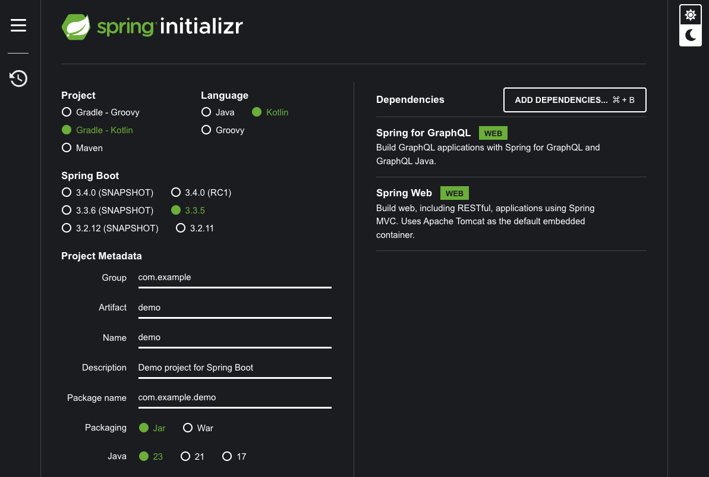
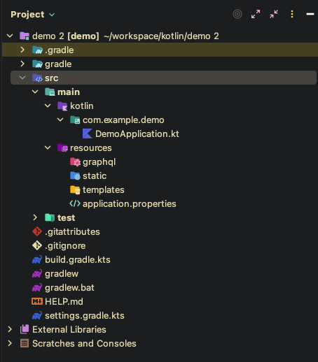

## Spring Initializr でプロジェクト作成

https://start.spring.io/



とりあえずこれで作成して、必要になった Dependencies は後から付け足します。

ダウンロードしたプロジェクトを Java や Kotlin と相性がいい IntelliJ IDEA で開きます。
無料版として IntelliJ IDEA Community Edition もあるので、今回はこちらを使います。

https://www.jetbrains.com/ja-jp/idea/download/?section=mac



作成されたパッケージを開くとこんな感じです。resources 配下に graphql パッケージが作成されていますね。
ここに schema ファイルを保存するみたいです。

今回はざっくりこんな構成で行きます。

## パッケージ構成・アーキテクチャ

オニオンアーキテクチャ風で行きたいと思います。

`com.example.demo` 配下

- `presentation` Controller クラス や Request/Response 用の DTO を置くところ
- `application` Application Service クラス を置くところ
- `domain` エンティティや Domain Service クラスを置くところ
- `infrastructure` Repository クラスなど DB や外部プラットフォームと繋ぐところ

## 初期設定

`application.properties`ファイルを`application.yml` ファイルに変更します。
別にどっちでもいいのですが、私が yml の方が慣れているので変更しておきます。

spring.graphql.path はこの API のエンドポイント
graphiql というのは開発ツールです。これだけで使えて簡単なので `enabled` を `true` にしておきます。

```yml
spring:
  application:
    name: demo
  graphql:
    path: /graphql
    graphiql:
      enabled: true
```

## GraphQL が叩けることを確認

まずは GraphQL が叩けることを確認しましょう。

`resources/graphql`配下に `schema.grahqls`ファイルを作成してください。
今回は Post というユーザーが投稿した程のものを表示させるための実装を行います。

```graphql
type Query {
  posts: [Post!]!
}

type Post {
  id: Int!
  content: String!
}
```

### Controller から返してみる

domain パッケージに model パッケージを作成して、その中に`Post.kt`を作成します。

```kotlin
data class Post(
    val id: Int,
    val content: Int
)
```

presentation パッケージに controller パッケージを追加し`PostController.kt`を作成します。
この中に`posts`というメソッドを作成します。このメソッドと schema.graphqls に書いたクエリを紐づけるわけですね。

紐づけるためには`@QueryMapping`というアノテーションを追加します。なんとこれだけで紐づきます。簡単ですね。

```kotlin
@Controller
class PostController() {

    @QueryMapping
    fun posts(): List<Post> = [Post(1, "投稿1"), Post(2, "投稿2")]
}
```

続く
